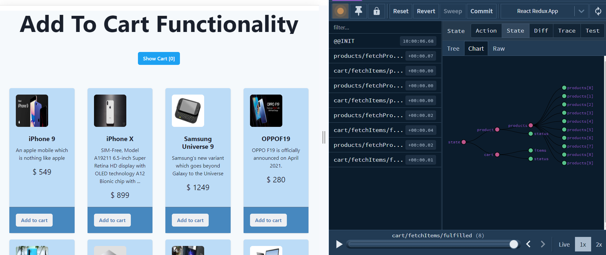
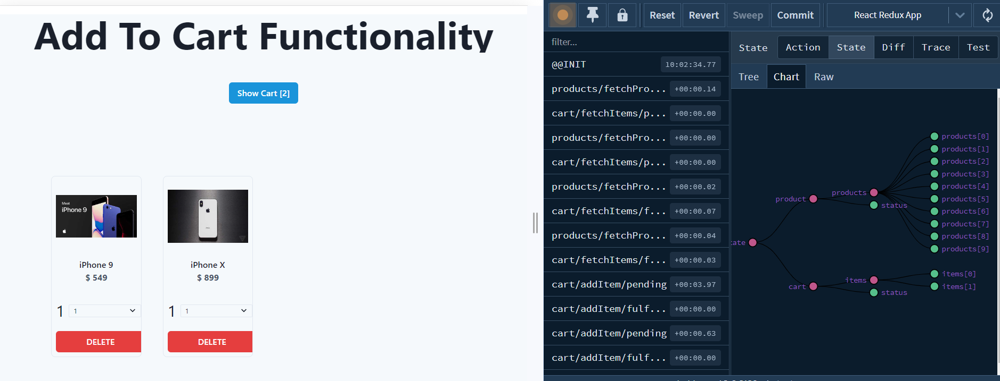

# Getting Started with Create React App and Redux

This project was bootstrapped with [Create React App](https://github.com/facebook/create-react-app), using the [Redux](https://redux.js.org/) and [Redux Toolkit](https://redux-toolkit.js.org/) template.

## Available Scripts

In the project directory, you can run:

### `npm start`

Runs the app in the development mode.\
Open [http://localhost:3000](http://localhost:3000) to view it in your browser.

The page will reload when you make changes.\
You may also see any lint errors in the console.

### `json-server db.json -p 8080`

Run this command to start json server which will fetch data from db.json.

Open [http://localhost:8080/products](http://localhost:8080/products) to view the product data in json format in URL.

Open [http://localhost:8080/cart](http://localhost:8080/cart) to view cart data in json format in URL.

## Product Page

## Cart Page

## Features abd Technologies uses

- ReactJS
- Redux Toolkit
- Async Thunks
- Axios
- chakra UI
- Json Server

## Learn More

You can learn more in the [Create React App documentation](https://facebook.github.io/create-react-app/docs/getting-started).

To learn React, check out the [React documentation](https://reactjs.org/).
